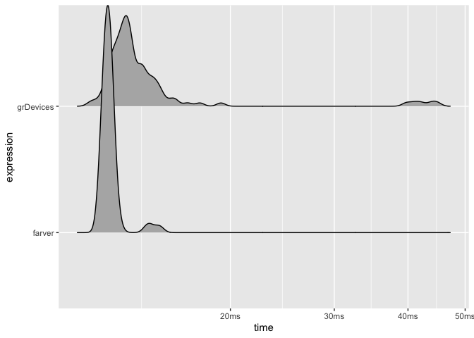

<!-- README.md is generated from README.Rmd. Please edit that file -->

# farver <a href='https://farver.data-imaginist.com'></a>

<!-- badges: start -->

[](https://github.com/thomasp85/farver/actions/workflows/R-CMD-check.yaml)
[](https://cran.r-project.org/package=farver)
[](https://cran.r-project.org/package=farver)
[](https://app.codecov.io/gh/thomasp85/farver?branch=master)
<!-- badges: end -->

The goal of farver is to provide very fast, vectorised functions for
conversion of colours between different colour spaces, colour
comparisons (distance between colours), encoding/decoding, and channel
manipulation in colour strings. To this end it provides an interface to
a modified version of the
[ColorSpace](https://github.com/berendeanicolae/ColorSpace) C++ library
developed by Berendea Nicolae.

## Installation

farver can be installed from CRAN using `install.packages('farver')`.
The development version can be installed from Github using `devtools`:

``` r
# install.packages('devtools')
devtools::install_github('thomasp85/farver')
```

## Use

farver provides an alternative to the `grDevices::rgb()` and
`grDevices::col2rgb()` for encoding and decoding colours strings. The
farver functions are superficially equivalent but provides a uniform
output format, and the option to encode and decode directly from/to
other colour spaces.

``` r
library(farver)

codes <- rainbow(10)
codes
#>  [1] "#FF0000" "#FF9900" "#CCFF00" "#33FF00" "#00FF66" "#00FFFF" "#0066FF"
#>  [8] "#3300FF" "#CC00FF" "#FF0099"

spectrum <- decode_colour(codes)
spectrum
#>         r   g   b
#>  [1,] 255   0   0
#>  [2,] 255 153   0
#>  [3,] 204 255   0
#>  [4,]  51 255   0
#>  [5,]   0 255 102
#>  [6,]   0 255 255
#>  [7,]   0 102 255
#>  [8,]  51   0 255
#>  [9,] 204   0 255
#> [10,] 255   0 153

encode_colour(spectrum)
#>  [1] "#FF0000" "#FF9900" "#CCFF00" "#33FF00" "#00FF66" "#00FFFF" "#0066FF"
#>  [8] "#3300FF" "#CC00FF" "#FF0099"
```

It also provides an alternative to `grDevices::convertColor()` to switch
between colours spaces. If the origin is a colour string it is possible
to decode directly into the given colour space. Conversely, if the
endpoint is a colour string it is also possible to encode directly from
a given colour space.

``` r
spectrum_lab <- convert_colour(spectrum, 'rgb', 'lab')
spectrum_lab
#>              l         a           b
#>  [1,] 53.24079  80.09246   67.203197
#>  [2,] 72.26072  30.16539   77.224482
#>  [3,] 93.60533 -41.94504   90.274226
#>  [4,] 88.07403 -83.10813   83.593379
#>  [5,] 88.19634 -80.27943   57.926987
#>  [6,] 91.11322 -48.08753  -14.131186
#>  [7,] 47.90478  35.19678  -82.006104
#>  [8,] 33.81896  79.70044 -105.279006
#>  [9,] 51.90416  90.99470  -74.834222
#> [10,] 55.65103  86.52861   -9.719051

decode_colour(codes, to = 'lab')
#>              l         a           b
#>  [1,] 53.24079  80.09246   67.203197
#>  [2,] 72.26072  30.16539   77.224482
#>  [3,] 93.60533 -41.94504   90.274226
#>  [4,] 88.07403 -83.10813   83.593379
#>  [5,] 88.19634 -80.27943   57.926987
#>  [6,] 91.11322 -48.08753  -14.131186
#>  [7,] 47.90478  35.19678  -82.006104
#>  [8,] 33.81896  79.70044 -105.279006
#>  [9,] 51.90416  90.99470  -74.834222
#> [10,] 55.65103  86.52861   -9.719051

encode_colour(spectrum_lab, from = 'lab')
#>  [1] "#FF0000" "#FF9900" "#CCFF00" "#33FF00" "#00FF66" "#00FFFF" "#0066FF"
#>  [8] "#3300FF" "#CC00FF" "#FF0099"
```

If colours are given as strings, manipulation of channels will normally
require decoding, conversion to the correct colour space, manipulation
of the given channel, converting back to rgb and the encoding to string.
farver provides a range of functions that allow you to change any
channel in the supported spaces directly in colour strings:

``` r
# Add a value to the channel
add_to_channel(codes, channel = 'l', value = 1:10, space = 'lab')
#>  [1] "#FF0C03" "#FF9E0E" "#D5FF1C" "#48FF20" "#33FF74" "#3CFFFF" "#3D77FF"
#>  [8] "#5A25FF" "#E839FF" "#FF41B4"

# Set a channel to a specific value
set_channel(codes, 'alpha', c(0.3, 0.7))
#>  [1] "#FF00004C" "#FF9900B2" "#CCFF004C" "#33FF00B2" "#00FF664C" "#00FFFFB2"
#>  [7] "#0066FF4C" "#3300FFB2" "#CC00FF4C" "#FF0099B2"

# Limit a channel to a given value
cap_channel(codes, 'r', 200)
#>  [1] "#C80000" "#C89900" "#C8FF00" "#33FF00" "#00FF66" "#00FFFF" "#0066FF"
#>  [8] "#3300FF" "#C800FF" "#C80099"
```

Lastly, farver also provides utilities for calculating the distance
between colours, based on a range of different measures

``` r
spectrum2 <- t(col2rgb(heat.colors(10)))

compare_colour(spectrum, spectrum2, 'rgb', method = 'cie2000')[1:6, 1:6]
#>          [,1]     [,2]      [,3]     [,4]     [,5]     [,6]
#> [1,]  0.00000  1.95065  7.130898 15.53837 27.08237 39.88958
#> [2,] 29.50083 27.56585 22.402612 13.98117  2.41602 10.31341
#> [3,] 72.33606 70.32974 64.926436 55.98592 43.59987 30.24747
#> [4,] 85.84698 83.68842 77.854648 68.19997 55.06314 41.59064
#> [5,] 85.92110 83.79762 78.073545 68.67184 56.07682 43.42965
#> [6,] 70.95853 69.55274 65.907013 60.35739 53.72218 47.94387
```

## Supported colour spaces

`farver` currently supports the following colour spaces:

-   CMY
-   CMYK
-   HSL
-   HSB
-   HSV
-   CIE L\*AB
-   Hunter LAB
-   OK LAB
-   LCH(ab)
-   LCH(uv)
-   LCH(OK)
-   LUV
-   RGB
-   XYZ
-   YXY

## Supported distance measures

`farver` supports the following colour distance metrics

-   Euclidean
-   CIE1976
-   CIE94
-   CIE2000
-   CMC

## White References

`farver` allows you to set the white point for relative colour spaces,
either based on a standard illuminant (A-F series supported) or by
specifying chromaticity coordinates or tristimulus values directly

## Benchmark

`farver` is faster than its `grDevices` counterpart but less so than it
was at its first release, as the colour conversion in grDevices has been
improved since.

``` r
library(ggplot2)
test <- matrix(runif(300000, min = 0, max = 255), ncol = 3)
timing <- bench::mark(
  farver = convert_colour(test, 'rgb', 'lab'),
  grDevices = convertColor(test, 'sRGB', 'Lab', scale.in = 255), 
  check = FALSE,
  min_iterations = 100
)
#> Warning: Some expressions had a GC in every iteration; so filtering is disabled.
plot(timing, type = 'ridge')
```

<!-- -->

Still, if the start- and/or endpoint are colour strings the ability to
decode and encode directly from/to any colour space will give a huge
speed up.

``` r
colour_strings <- colours()
timing <- bench::mark(
  farver = decode_colour(colour_strings, to = 'lab'),
  grDevices = convertColor(t(col2rgb(colour_strings)), 'sRGB', 'Lab', scale.in = 255), 
  check = FALSE,
  min_iterations = 100
)
plot(timing, type = 'ridge')
```

<!-- -->

## Code of Conduct

Please note that the ‘farver’ project is released with a [Contributor
Code of
Conduct](https://farver.data-imaginist.com/CODE_OF_CONDUCT.html). By
contributing to this project, you agree to abide by its terms.
