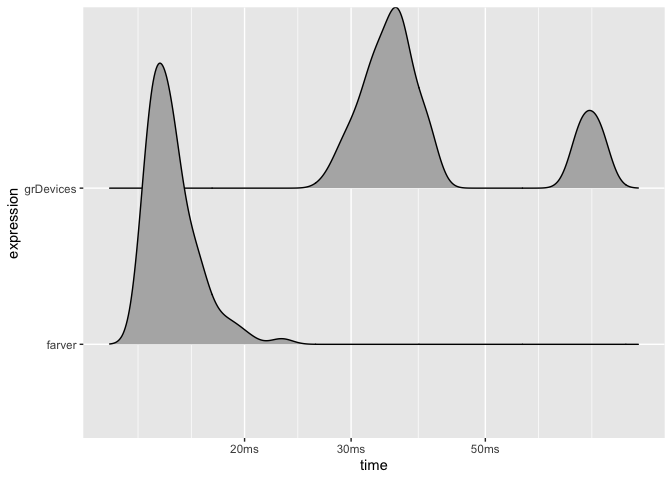

<!-- README.md is generated from README.Rmd. Please edit that file -->

# farver

[](https://travis-ci.org/thomasp85/farver)
[](https://ci.appveyor.com/project/thomasp85/farver)
[](http://cran.r-project.org/package=farver)
[](http://cran.r-project.org/package=farver)
[](https://codecov.io/github/thomasp85/farver?branch=master)

The goal of `farver` is to provide very fast, vectorised conversion of
colours between different colour spaces, as well as provide fast colour
comparisons (distance between colours). To this end it provides an
interface to a modified version of the
[ColorSpace](https://github.com/berendeanicolae/ColorSpace) C++ library
developed by Berendea Nicolae.

## Installation

`farver` can be installed from CRAN using `install.packages('farver')`.
The development version can be installed from Github using `devtools`:

``` r
# install.packages('devtools')
devtools::install_github('thomasp85/farver')
```

## Use

The main functions of the package are`convert_colour()` with an
interface very much alike `grDevices::convertColor()`, and
`compare_colour()` which allows you to calculate the distance between
colours using different metrics

### Conversion

``` r
library(farver)

spectrum <- t(col2rgb(rainbow(10)))
spectrum
#>       red green blue
#>  [1,] 255     0    0
#>  [2,] 255   153    0
#>  [3,] 204   255    0
#>  [4,]  51   255    0
#>  [5,]   0   255  102
#>  [6,]   0   255  255
#>  [7,]   0   102  255
#>  [8,]  51     0  255
#>  [9,] 204     0  255
#> [10,] 255     0  153

convert_colour(spectrum, 'rgb', 'lab')
#>              l         a           b
#>  [1,] 53.24079  80.09246   67.203197
#>  [2,] 72.26072  30.16539   77.224482
#>  [3,] 93.60533 -41.94504   90.274226
#>  [4,] 88.07403 -83.10813   83.593379
#>  [5,] 88.19634 -80.27943   57.926987
#>  [6,] 91.11322 -48.08753  -14.131186
#>  [7,] 47.90478  35.19678  -82.006104
#>  [8,] 33.81896  79.70044 -105.279006
#>  [9,] 51.90416  90.99470  -74.834222
#> [10,] 55.65103  86.52861   -9.719051
```

### Comparison

``` r
spectrum2 <- t(col2rgb(heat.colors(10)))

compare_colour(spectrum, spectrum2, 'rgb', method = 'cie2000')[1:6, 1:6]
#>          [,1]     [,2]      [,3]     [,4]     [,5]     [,6]
#> [1,]  0.00000  1.95065  7.130898 15.53837 27.08237 39.88958
#> [2,] 29.50083 27.56585 22.402612 13.98117  2.41602 10.31341
#> [3,] 72.33606 70.32974 64.926436 55.98592 43.59987 30.24747
#> [4,] 85.84698 83.68842 77.854648 68.19997 55.06314 41.59064
#> [5,] 85.92110 83.79762 78.073545 68.67184 56.07682 43.42965
#> [6,] 70.95853 69.55274 65.907013 60.35739 53.72218 47.94387
```

## Supported colour spaces

`farver` currently supports the following colour spaces:

  - CMY
  - CMYK
  - HSL
  - HSB
  - HSV
  - CIE L\*AB
  - Hunter LAB
  - LCH
  - LUV
  - RGB
  - XYZ
  - YXY

## Supported distance measures

`farver` supports the following colour distance metrics

  - Euclidean
  - CIE1976
  - CIE94
  - CIE2000
  - CMC

## White References

`farver` allows you to set the white point for relative colour spaces,
either based on a standard illuminant (A-F series supported) or by
specifying chromaticity coordinates or tristimulus values directly

## Benchmark

`farver` is faster than its `grDevices` counterpart but less so than it
was at its first release, as the colour conversion in grDevices has been
improved since.

``` r
library(ggplot2)
test <- matrix(runif(300000, min = 0, max = 255), ncol = 3)
timing <- bench::mark(
  farver = convert_colour(test, 'rgb', 'lab'),
  grDevices = convertColor(test, 'sRGB', 'Lab', scale.in = 255), 
  check = FALSE,
  iterations = 100,
  filter_gc = FALSE
)
plot(timing, type = 'ridge')
```

<!-- -->
